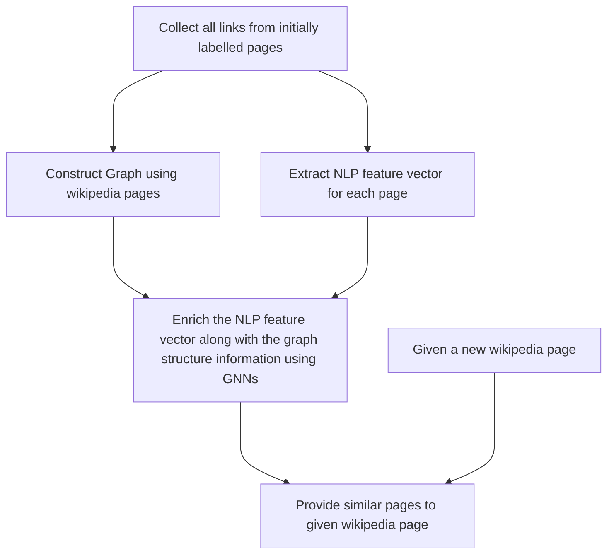

# Wikipedia-Graph analysis
##### The analysis done previously can be found in the "Naive" directory. The name only suggests that the coming approaches will be more sophisticated. 
##### Dataset that can be used : 
1. [Wikispeedia navigation paths](https://snap.stanford.edu/data/wikispeedia.html)
2. [Wikipedia networks](https://snap.stanford.edu/data/wikipedia-article-networks.html)

##### Useful link to save notebook state: [Save notebook state](https://stackoverflow.com/questions/34342155/how-to-pickle-or-store-jupyter-ipython-notebook-session-for-later)
#### Below is a tentative plan to do this analysis in a systematic manner:

